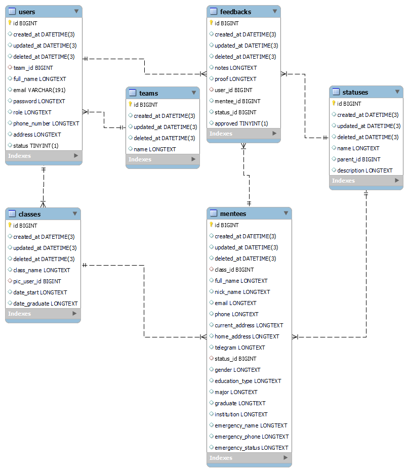

# Mentor Management (Immersive Dashboard Project)
    
## 💫 About
Immersive Dashboard is an Immersive student data management application at Alterra Academy. As a software engineer, this application was made to assist in carrying out learning activities at Alterra Academy.

## 👨🏽‍💻 Clone Repo
```shell
git clone https://github.com/Findryankp/mentor-manajement
```

## 🎯 Run Project
```shell
go run .
```

## 🚀 Tech Stack
### 🧰Backend

<p align="Left"> 
  <a href="https://aws.amazon.com/" target="_blank" rel="noreferrer">
     </a> 
  <a href="https://postman.com/" target="_blank" rel="noreferrer"> 
     </a> 
  <a href="https://www.dockere.com/" target="_blank" rel="noreferrer"> 
     </a> 
  <a href="https://www.ubuntu.com/" target="_blank" rel="noreferrer"> 
     </a>
  <a href="https://www.swagger.com/" target="_blank" rel="noreferrer"> 
     </a>
  <a href="https://www.jwt.io/" target="_blank" rel="noreferrer"> 
     </a>
  <a href="https://github.com/" target="_blank" rel="noreferrer">
     </a> 
  <a href="https://skillicons.dev">
    
  </a>
 </p>

## 🤖Author

- Findryan Kurniap :

  []([https://github.com/Findryankp)
- Rischi Yuda:

  [ 
  ](https://www.linkedin.com/in/rischi-yuda-ryo17/)

- Ida Kusumawati :

  []([https://github.com/kocwng)

## *Entity Relational Database*

## 
<h3 align="Left">Programming Language :</h3>
<p align="Left"> 
  <a href="https://go.dev/" target="_blank" rel="noreferrer"> 
     </a> 
  <a href="https://www.mysql.com/" target="_blank" rel="noreferrer">
    &nbsp;
    </a>
</p>


 

